# ASAIR 多渠道 AI 客服平台 - 业务场景图

本文档从产品使用角度，使用 Mermaid 语法绘制各种业务场景图，展示不同角色如何使用系统。

---

## 一、用户与 AI 客服对话完整流程

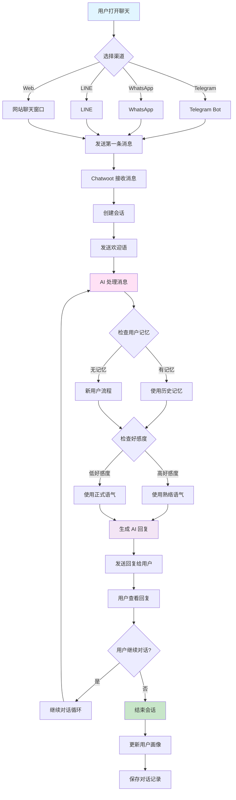

---

## 二、商户管理员配置 AI 助手流程

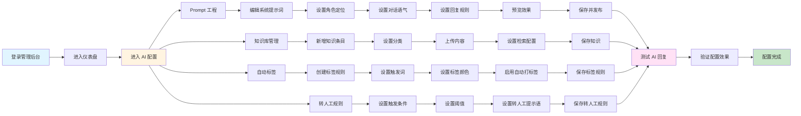

---

## 三、平台管理员管理商户流程

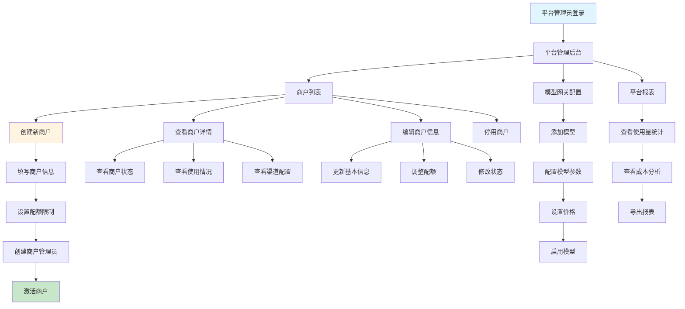

---

## 四、人工客服接管流程

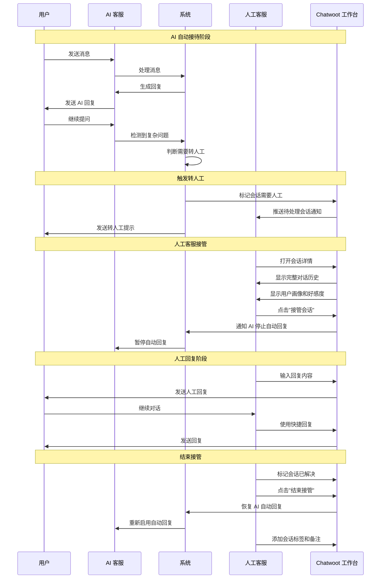

---

## 五、多渠道接入场景

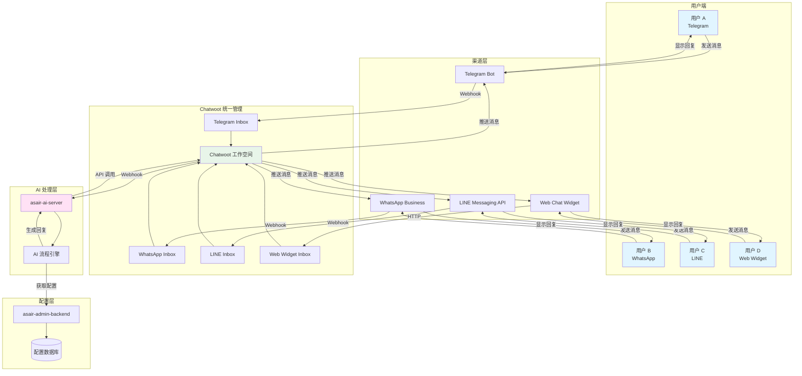

---

## 六、好感度系统工作流程

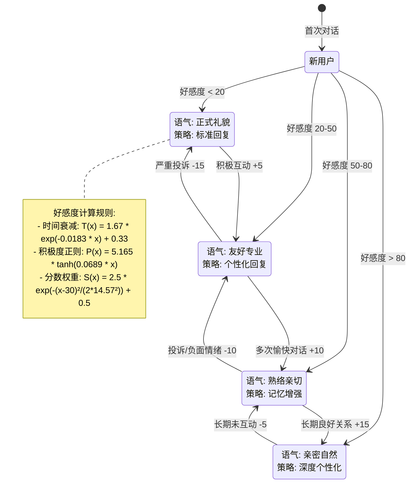

---

## 七、转人工触发场景

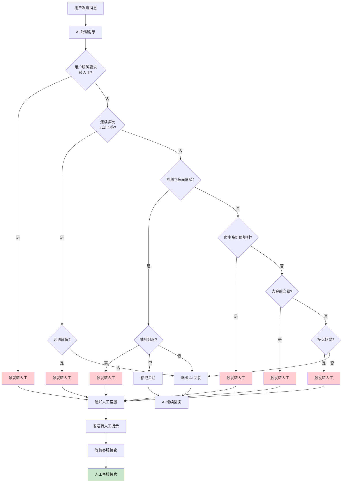

---

## 八、会话节奏控制场景

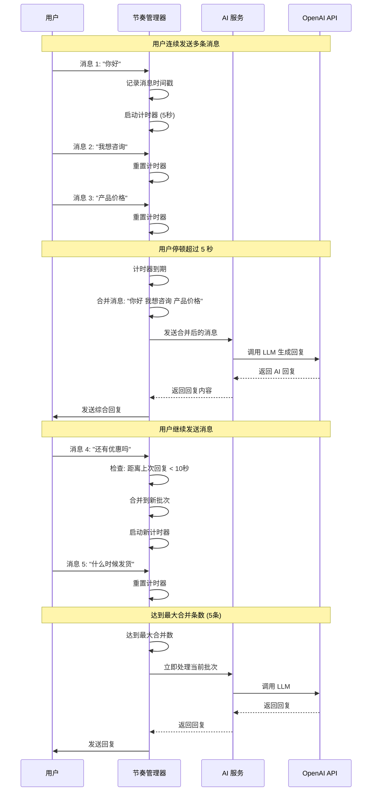

---

## 九、商户运营工作流

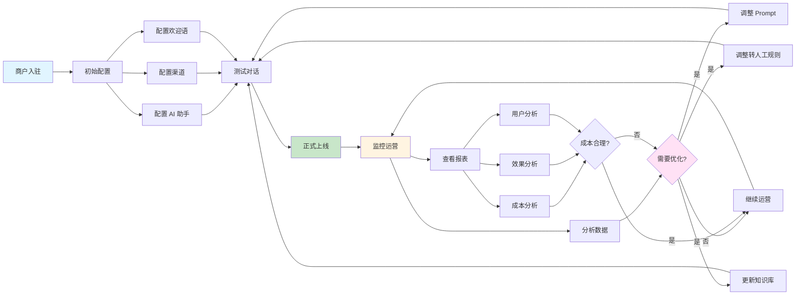

---

## 十、用户旅程图

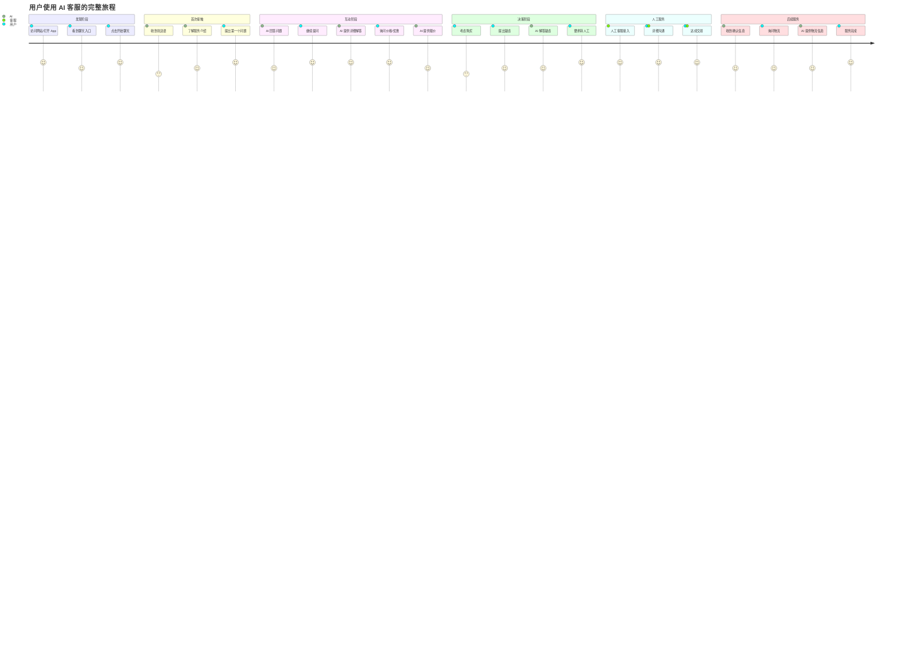

---

## 十一、知识库检索场景

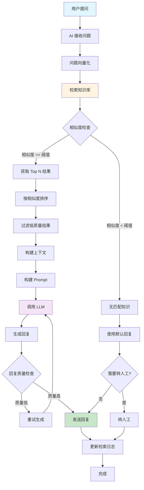

---

## 十二、报表查看与分析场景

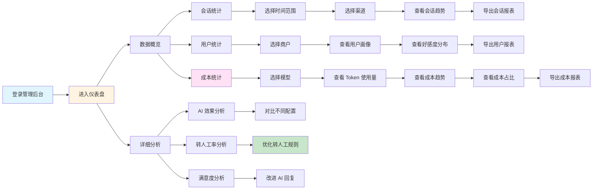

---

## 十三、多租户数据隔离场景

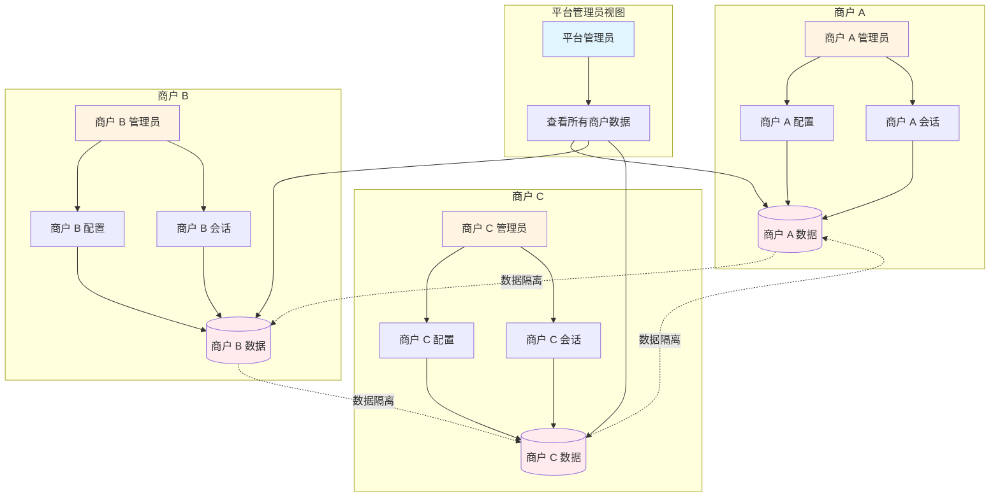

---

## 十四、自动标签工作流程

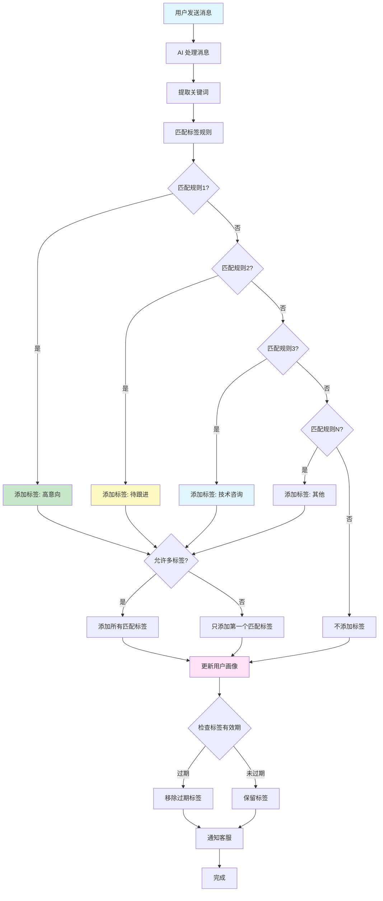

---

## 十五、错误处理与降级策略

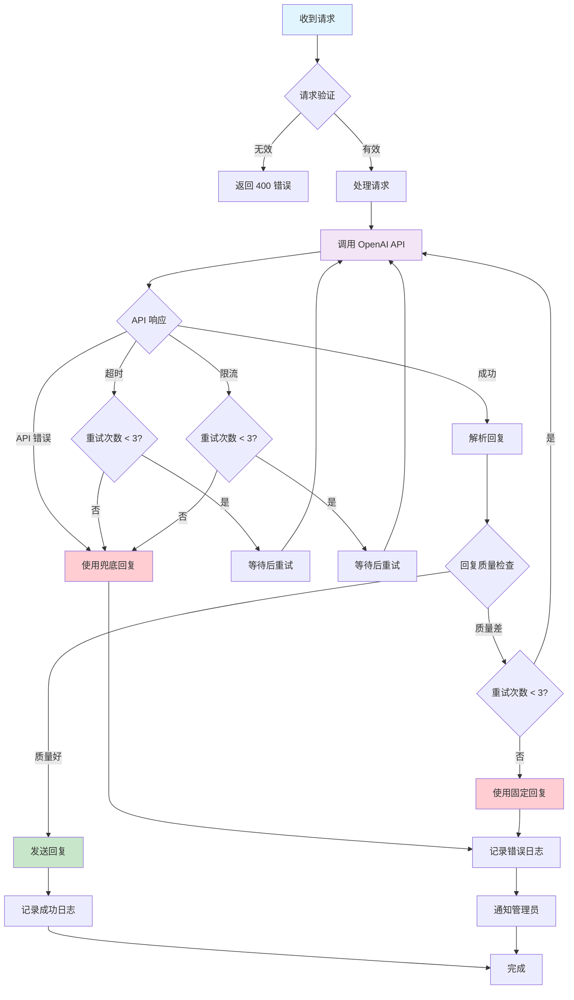

---

## 使用说明

以上业务场景图使用 Mermaid 语法编写，展示了：

1. **用户视角**：用户与 AI 客服的完整对话流程
2. **商户管理员视角**：配置 AI 助手、知识库、标签规则等
3. **平台管理员视角**：管理商户、配置模型、查看报表
4. **人工客服视角**：接管会话、处理复杂问题
5. **系统视角**：多渠道接入、好感度系统、转人工触发、节奏控制等

这些图表可以在支持 Mermaid 的平台查看，如：
- GitHub/GitLab
- VS Code（安装 Mermaid 插件）
- https://mermaid.live/
- Notion/Obsidian

---

**最后更新**: 2025-01-XX

