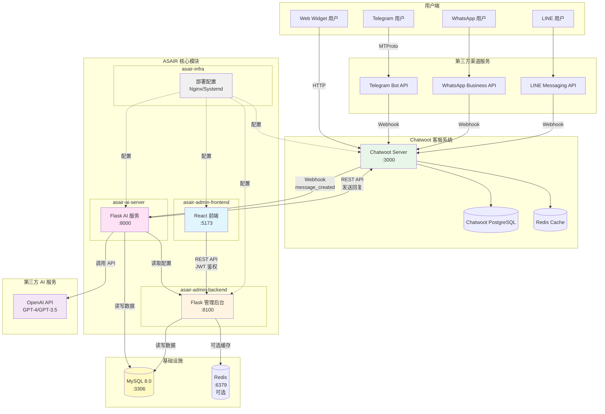
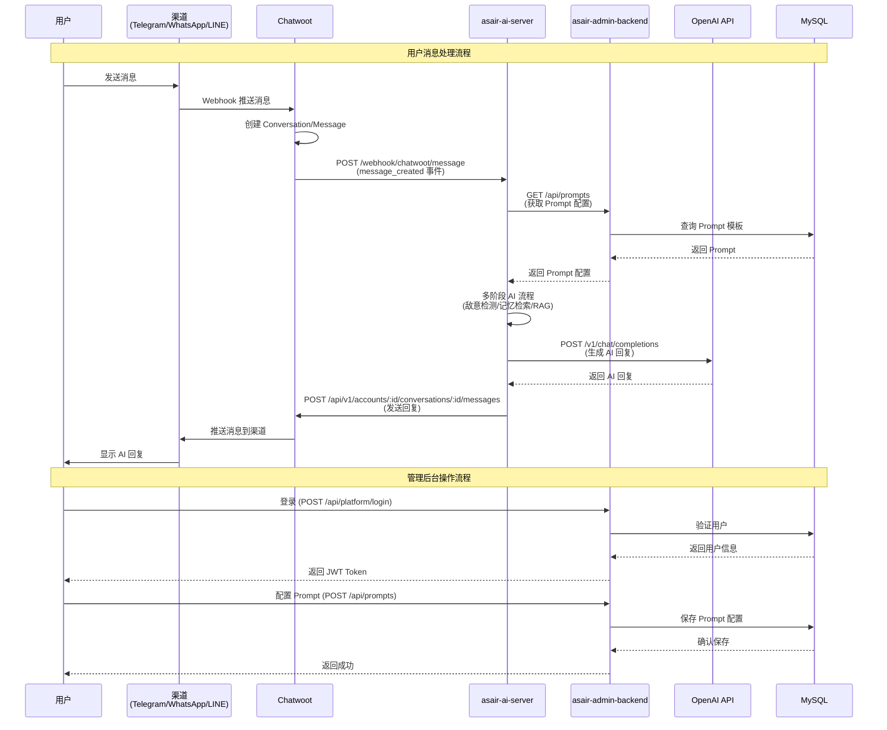
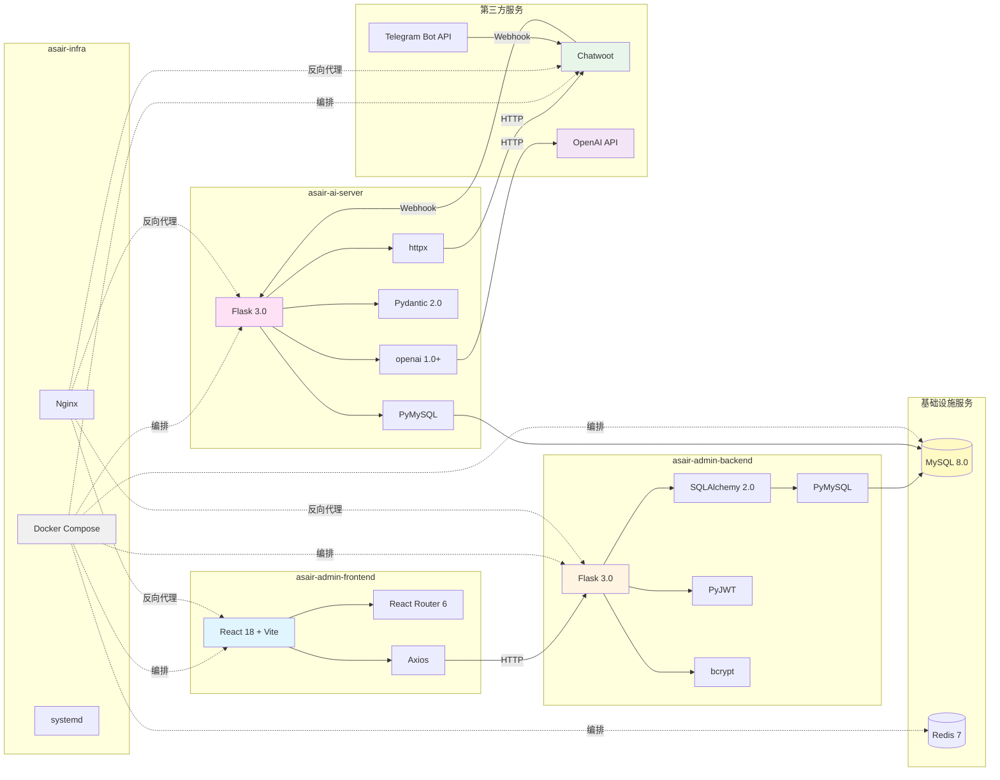
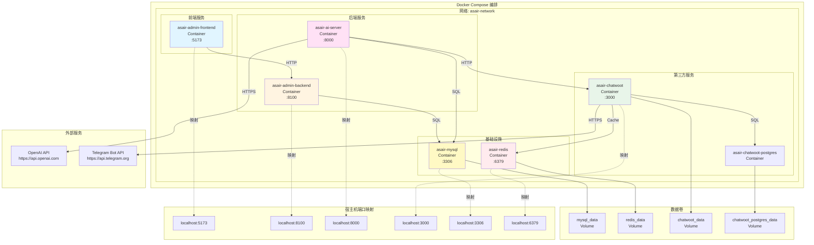
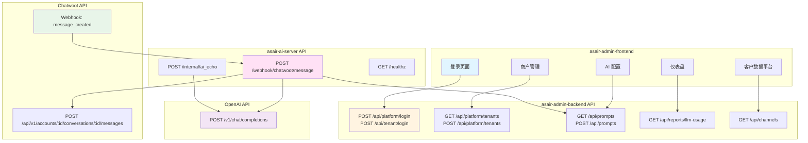
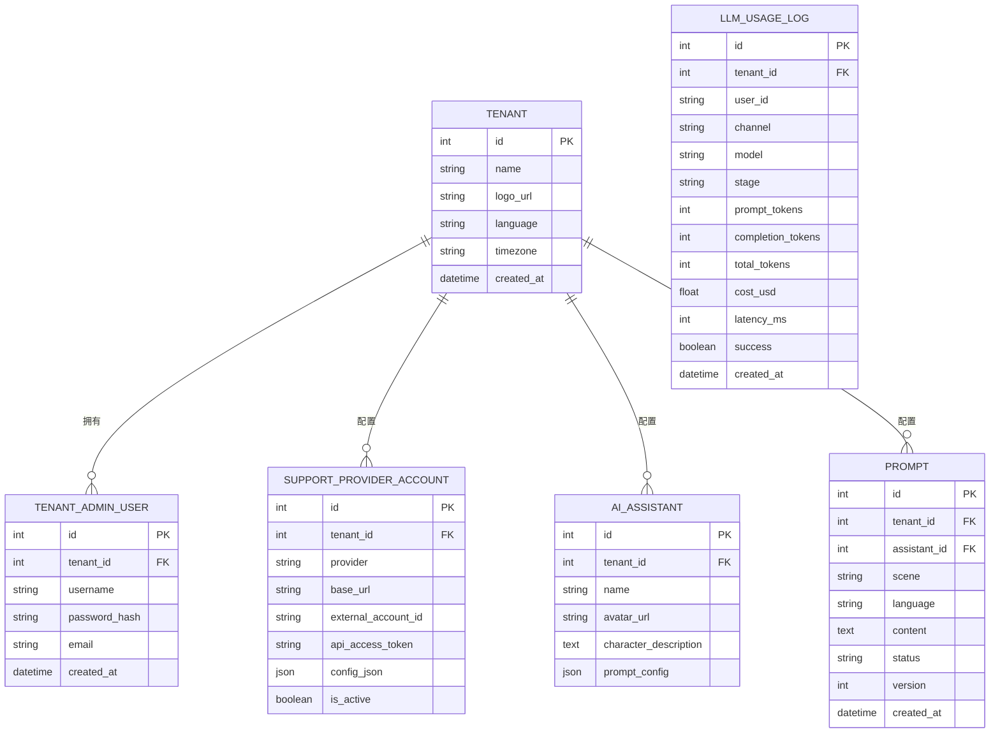
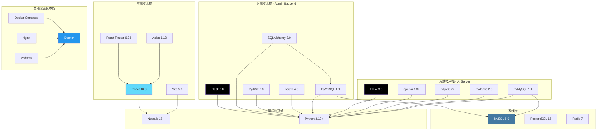
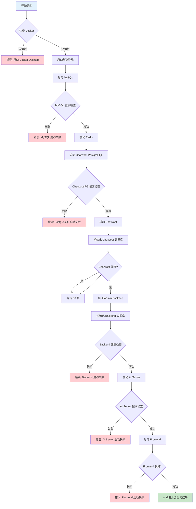

# ASAIR 多渠道 AI 客服平台 - 系统架构图

本文档使用 Mermaid 语法绘制系统架构图，展示四个核心模块与相关软件、第三方服务的依赖关系。

---

## 一、整体架构图

---

## 二、数据流架构图

---

## 三、模块依赖关系图

---

## 四、部署架构图

---

## 五、API 调用关系图

---

## 六、数据库关系图

---

## 七、技术栈依赖图

---

## 八、服务启动顺序图

---

## 九、消息流转完整路径

```mermaid
flowchart LR
    A[用户发送消息] --> B[Telegram/WhatsApp/LINE]
    B --> C[渠道 Webhook]
    C --> D[Chatwoot 接收]
    D --> E[Chatwoot 创建 Message]
    E --> F[Chatwoot 触发 Webhook]
    F --> G[asair-ai-server 接收]
    G --> H[解析 Webhook Payload]
    H --> I[从 asair-admin-backend<br/>获取 Prompt 配置]
    I --> J[执行多阶段 AI 流程]
    J --> K[调用 OpenAI API]
    K --> L[生成 AI 回复]
    L --> M[调用 Chatwoot API<br/>发送回复]
    M --> N[Chatwoot 推送消息]
    N --> O[渠道推送]
    O --> P[用户收到回复]
    
    style A fill:#e1f5ff
    style G fill:#ffe1f5
    style K fill:#f3e5f5
    style P fill:#c8e6c9
```

---

## 十、环境变量配置关系

```mermaid
graph TB
    subgraph ".env 文件"
        ENV_FILE[.env]
    end

    subgraph "asair-admin-backend 环境变量"
        BE_ENV1[DATABASE_URL]
        BE_ENV2[JWT_SECRET_KEY]
        BE_ENV3[JWT_ALGORITHM]
        BE_ENV4[ASAIR_ADMIN_ENV]
    end

    subgraph "asair-ai-server 环境变量"
        AI_ENV1[DATABASE_URL]
        AI_ENV2[CHATWOOT_BASE_URL]
        AI_ENV3[CHATWOOT_API_ACCESS_TOKEN]
        AI_ENV4[OPENAI_API_KEY]
        AI_ENV5[OPENAI_API_BASE]
    end

    subgraph "Chatwoot 环境变量"
        CW_ENV1[POSTGRES_HOST]
        CW_ENV2[POSTGRES_PASSWORD]
        CW_ENV3[REDIS_URL]
        CW_ENV4[SECRET_KEY_BASE]
    end

    ENV_FILE -->|docker-compose.yml 读取| BE_ENV1
    ENV_FILE -->|docker-compose.yml 读取| BE_ENV2
    ENV_FILE -->|docker-compose.yml 读取| BE_ENV3
    ENV_FILE -->|docker-compose.yml 读取| BE_ENV4
    
    ENV_FILE -->|docker-compose.yml 读取| AI_ENV1
    ENV_FILE -->|docker-compose.yml 读取| AI_ENV2
    ENV_FILE -->|docker-compose.yml 读取| AI_ENV3
    ENV_FILE -->|docker-compose.yml 读取| AI_ENV4
    ENV_FILE -->|docker-compose.yml 读取| AI_ENV5
    
    ENV_FILE -->|docker-compose.yml 读取| CW_ENV1
    ENV_FILE -->|docker-compose.yml 读取| CW_ENV2
    ENV_FILE -->|docker-compose.yml 读取| CW_ENV3
    ENV_FILE -->|docker-compose.yml 读取| CW_ENV4

    style ENV_FILE fill:#fff9c4
    style BE_ENV1 fill:#fff4e1
    style AI_ENV4 fill:#ffe1f5
    style CW_ENV4 fill:#e8f5e9
```

---

## 使用说明

以上架构图使用 Mermaid 语法编写，可以在以下平台查看：

1. **GitHub/GitLab**: 直接支持 Mermaid 渲染
2. **VS Code**: 安装 "Markdown Preview Mermaid Support" 插件
3. **在线编辑器**: https://mermaid.live/
4. **Notion/Obsidian**: 支持 Mermaid 语法

## 图例说明

- **蓝色**: 前端相关
- **黄色**: 后端管理服务
- **粉色**: AI 服务
- **绿色**: 第三方服务（Chatwoot）
- **紫色**: 外部 API（OpenAI）
- **灰色**: 基础设施配置

---

**最后更新**: 2025-01-XX

